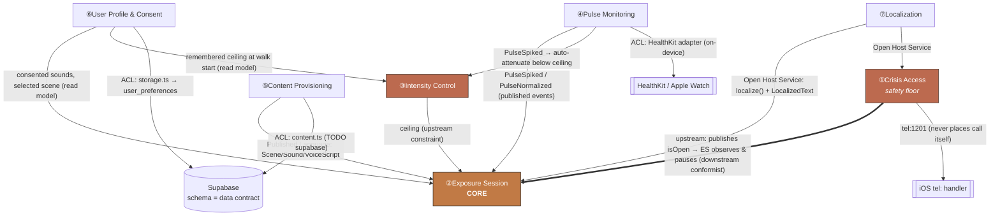

# HearO — Domain Model (Domain-Driven Design)

> Documentation, not code. A **strategic + tactical DDD map** of HearO, derived
> from [`../prd.md`](../prd.md) and the binding [`../../openspec/specs/`](../../openspec/)
> capabilities. It names the domains, their language, their boundaries, and the
> invariants that hold them together — so the code can keep its current pragmatic
> shape while everyone shares one model of the problem.

HearO is a **monolithic React Native frontend** talking directly to Supabase
([`../CONVENTIONS.md`](../CONVENTIONS.md) §1). There is no backend service layer,
so the "bounded contexts" here are **logical domains inside one app**, not
microservices. The Supabase schema is the data contract; today most domains read
from local seams (`src/lib/content/content.ts`, `src/lib/storage/storage.ts`) marked `TODO(supabase)`.

The core domain is **Exposure Session**. Its load-bearing supporting domains, in
the PRD's safety order, are **Crisis Access > Intensity Control > Exposure
Session** ([`../prd.md`](../prd.md) §6).

## Per-domain files

| # | Bounded context | Type | File |
|---|---|---|---|
| 1 | **Crisis Access** | Supporting (safety floor) | [`1-crisis-access.md`](./1-crisis-access.md) |
| 2 | **Exposure Session** | **Core** | [`2-exposure-session.md`](./2-exposure-session.md) |
| 3 | **Intensity Control** | Supporting (safety) | [`3-intensity-control.md`](./3-intensity-control.md) |
| 4 | **Pulse Monitoring** | Supporting | [`4-pulse-monitoring.md`](./4-pulse-monitoring.md) |
| 5 | **Content Provisioning** | Supporting | [`5-content-provisioning.md`](./5-content-provisioning.md) |
| 6 | **User Profile & Consent** | Supporting | [`6-user-profile-consent.md`](./6-user-profile-consent.md) |
| 7 | **Localization** | Generic | [`7-localization.md`](./7-localization.md) |

This index holds the **shared** material (language, context map, cross-cutting
policies, seams). Each file above holds one context's tactical model
(aggregates, value objects, domain events, invariants, code mapping, gaps).

---

## 1. Ubiquitous language

The team and the code use these terms with these exact meanings. Several are
deliberate *replacements* for clinical words ([`../prd.md`](../prd.md) §8) — the
persona is allergic to therapy-marketing, so the language is load-bearing, not
cosmetic.

| Term | Meaning in the model | Never say |
|---|---|---|
| **Walk** | One exposure session from begin → After screen. User-facing noun **and** the name of the core aggregate root ([`2-exposure-session.md`](./2-exposure-session.md)). | "treatment", "session" (to the user) |
| **Practice** | The ongoing activity of doing walks. | "therapy" |
| **Scene** | The *place* a walk happens in (beach/park/cafe/road) — ambient + imagery + voice. A **place** decision. | — |
| **Sound** | A user-recognizable trigger sound (motorcycle, siren…). | "trigger" (to the user) |
| **Consent / Consented sound** | A sound the user explicitly agreed to be exposed to. A **consent** decision, distinct from scene choice. | — |
| **Rehearsal walk** | A walk with an empty consent list → ambient + voice only, no sound enters. | — |
| **Phase** | One of three ordered stages: `opening` → `during` → `calming`. | — |
| **Ceiling** | The maximum trigger volume the user permits. A *ceiling*, not a level. | "volume level", "level N of M" |
| **Softer / Louder** | The only labels on the intensity control. | numbers, %, "intensity 7" |
| **Auto-attenuation** | System lowering output *below* the ceiling in response to pulse. Never above. | "auto volume" |
| **Attenuation** | The value-object delta between ceiling and actual output. | — |
| **Trigger clip** | The single audio variation chosen (once) for a sound in a given walk. Code: `TriggerClip` / `triggerSource`. | — |
| **Ghost indicator** | Visual showing *actual* output under the ceiling. | — |
| **Pulse** | Heart rate from Apple Watch / HealthKit, or the mocked generator. | "biometrics", "HR data" |
| **Crisis sheet** | The quiet panel offering ERAN 1201 + a trusted contact. | "panic button", "SOS", "emergency" |
| **ERAN 1201** | Israel's emotional-first-aid hotline, dialed via `tel:1201`. | — |
| **Check-in** | The three-option reflection after a walk (`still here` / `shaken` / `steady`). ⚠️ Code currently names this `Reflection` (`stillHere \| shaken \| steady`, `after.tsx`) — a ubiquitous-language drift to reconcile (§4 gaps). | "survey", "assessment" |
| **hear◯** | The wordmark (hear + O, O = breathing circle). English-only in both locales. | "Hero" |

Bilingual note: every user-facing term has an EN and HE form; Hebrew is the
fallback locale and the UI mirrors RTL ([`../prd.md`](../prd.md) §8). The wordmark
is the one string that is **not** translated.

---

## 2. Context map (strategic)

**Relationship legend** (using DDD's strategic patterns precisely)

- **Published Language** — Content Provisioning exposes `Scene` / `Sound` /
  `VoiceScript` as a stable shared vocabulary that Exposure Session consumes.
- **Upstream → Downstream (Conformist)** — Crisis Access is **upstream**: it
  publishes its `isOpen` state and knows nothing about sessions. Exposure Session
  is the **downstream conformist** — it observes `isOpen` (`session.tsx` reads
  `useCrisisStore`) and pauses. This is *not* Customer/Supplier (no negotiated,
  supplier-owned interface); it is a one-way state observation, closer to an
  Open Host / published-state dependency.
- **Anti-Corruption Layer (ACL)** — Content Provisioning and User Profile reach
  the Supabase schema *through* seams (`content.ts`, `storage.ts`) so the rest of
  the model never imports Supabase types directly (§4).
- **Open Host Service** — Localization exposes `localize()` + the `LocalizedText`
  vocabulary as a stable interface every context calls. Localization is a
  **Generic Subdomain** ([`7-localization.md`](./7-localization.md)), not a Shared
  Kernel: there is no jointly-owned, change-gated kernel — just a small published utility.

---

## 3. Cross-cutting domain policies (safety invariants)

These span contexts and are the product's non-negotiables. They belong in the
model explicitly because violating any one is a clinical/safety failure, not a bug:

1. **The ceiling is absolute.** Output may only ever go *down* from the user's
   ceiling. Because this rule reads a ceiling (Intensity Control), a pulse-driven
   floor (Pulse Monitoring), and applies inside a walk (Exposure Session), it is
   modeled as a single **domain service — `TriggerOutputPolicy`** — owned by
   Intensity Control and invoked by Exposure Session, rather than a floating
   invariant no aggregate owns. A rule spanning three contexts is a design smell;
   naming the service resolves it.
2. **Crisis is never observed.** No state transition in Crisis Access may reach
   analytics or Supabase — a **governance invariant of the Crisis Access context
   itself**, enforced by the deliberate absence of an event bus. (Not a
   relationship type — purely a privacy constraint.)
3. **Pulse stays on the device** unless the user explicitly shares a walk.
4. **No exposure without consent.** Exposure Session may only request clips for
   sounds present in User Profile's consent list; otherwise rehearsal walk.
5. **No drama on screen.** No popups/alarms/countdowns in any context during a
   walk — the only signal is the sub-perceptual breathing flash.

---

## 4. Anti-corruption layers, seams & system-wide gaps

The model stays clean of infrastructure by routing all external systems through
named seams. Nothing in the domain imports Supabase/HealthKit types directly.

| Seam (file) | Between | Today | Future |
|---|---|---|---|
| `src/lib/content/content.ts` | Content Provisioning ↔ Supabase | bundled local data | `supabase.from('scenes'/'sounds'/...)` reads; call sites gain `await` |
| `src/lib/storage/storage.ts` | User Profile ↔ device / Supabase | AsyncStorage | `user_preferences` row keyed by `auth.uid()` |
| `src/lib/integrations/pulse.ts` (+ future HealthKit adapter) | Pulse Monitoring ↔ HealthKit | mocked generator | HealthKit stream, on-device |
| `tel:1201` handoff | Crisis Access ↔ iOS dialer | implemented | unchanged (app never dials itself) |

Supabase **Row-Level Security** is the real authorization boundary; client-side
user-ID filters are UX hints, not security ([`../prd.md`](../prd.md) §9).

This documentation intentionally does **not** restructure `src/` into
`domain/application/infrastructure` folders. The existing `src/lib` (logic) +
`src/components` + `src/app` layout already separates domain logic from UI; the
contexts here are a *mental* model overlaid on that layout, plus the seams above.
Per-context gaps live in each context file; the cross-cutting ones:

### 4.1 Spec-compliance flags (code vs binding spec — not just doc gaps)

Places where the code appears to **violate a binding `openspec` contract** and
warrant a ticket, not just a doc note:

- **Crisis sheet open latency:** `crisis-access` spec requires the sheet usable
  within **200ms**; `CrisisSheet.tsx:16` animates over `SLIDE_MS = 600`. State
  flips instantly but the sheet isn't visible/usable for ~600ms. ([`1-crisis-access.md`](./1-crisis-access.md))
- **Ubiquitous-language drift:** the model term is **Check-in**; the code type is
  `Reflection` (`after.tsx:10`). Reconcile one way or the other. ([`2-exposure-session.md`](./2-exposure-session.md))
- **PRD vs code sound set:** `prd.md` §13 names `car-backfire`/`shouting`; code
  ships `car-horn`/`door-slam`. Align the PRD asset list to the code. ([`5-content-provisioning.md`](./5-content-provisioning.md))

---

## References

- [`../prd.md`](../prd.md) — product requirements (source for this model).
- [`../../openspec/specs/`](../../openspec/) — binding Given/When/Then contracts per capability.
- [`../RATIONALE.md`](../RATIONALE.md) — clinical reasoning behind the invariants.
- [`../CONVENTIONS.md`](../CONVENTIONS.md) — code structure these contexts overlay.
- [`../FRONTEND.md`](../FRONTEND.md) — screen specs realizing Exposure Session & Crisis Access.
